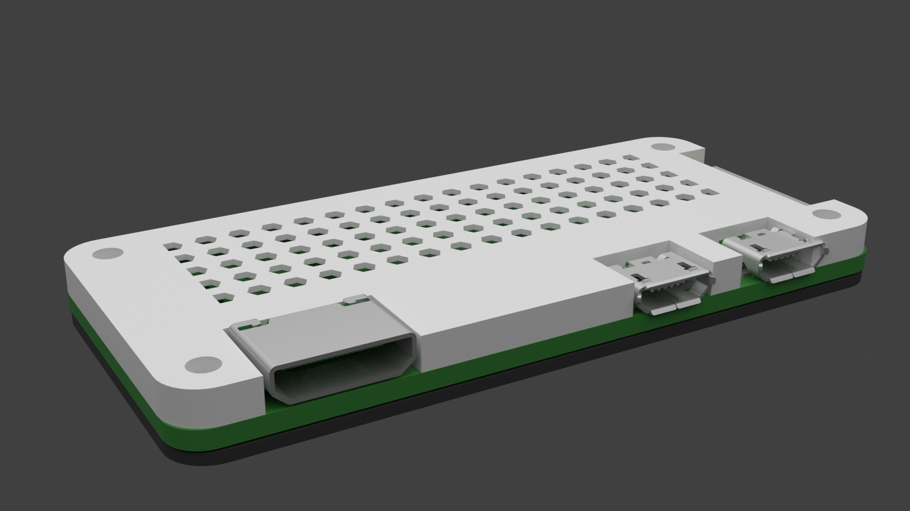

# Raspberry Pi Zero 2 W Case

CAD Models for a enclosure for the Raspberry Pi 2 W. The case is designed for board that have no GPIO connections for a slim form factor. The case requires 4 M3 screws.

## Files

### Enclosure

- `Case Bottom.stl`: Bottom part of the case.
- `Case Top.stl`: Top part of the case.
- `Case Patterned Top.stl`: Top part of the case but with a honeycomb pattern.

### Editing

- `Raspberry Pi Zero 2 W Case.f3d`: Fusion360 File for editing 

### Misc

- `Raspberry Pi Zero 2 W.STEP` and `Raspberry Pi Zero 2 W Model.stl`: Model of the Pi Zero 2 W used for modeling and render. Made by [Hasanain Shuja on GrabCAD](https://grabcad.com/library/raspberry-pi-zero-2-w-1).
- `render.blend`: Blender file for image render.
